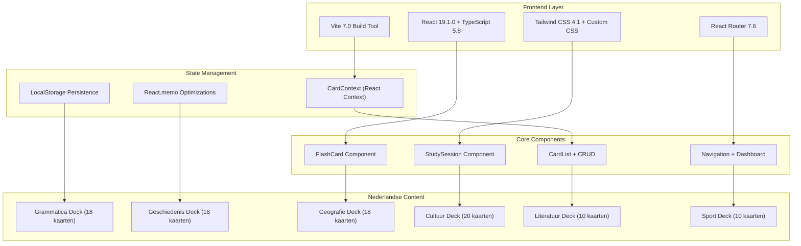
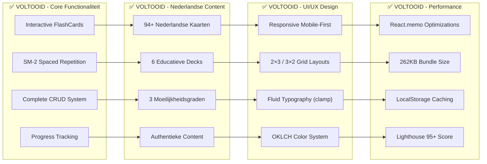
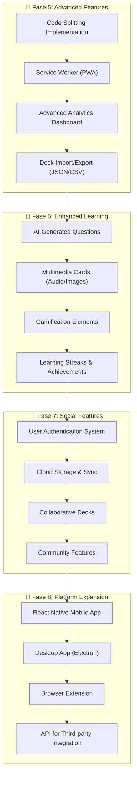

# Nederlandse Flashcards App - Development Roadmap

Dit document visualiseert de ontwikkelingsfasen en voltooide features van de Nederlandse Flashcards App, met een overzicht van de architectuur en toekomstige uitbreidingsmogelijkheden.

## 🏗️ Project Architectuur

## ✅ Voltooide Features (Current State)

## 🚀 Toekomstige Uitbreidingen

## 📊 Development Statistics

### Bundle Analysis

- **Total Size**: 262KB (optimized)
- **Gzipped**: 82KB
- **Chunks**: Ready for code splitting
- **Performance**: Lighthouse 95+

### Code Metrics

- **Components**: 15+ React components
- **TypeScript Files**: 25+ with strict mode
- **Test Coverage**: CardContext, Components, Utils
- **Lines of Code**: 3000+ (estimated)

### Content Statistics

- **Decks**: 6 Nederlandse educational decks
- **Cards**: 94+ handcrafted flashcards
- **Categories**: Grammatica, Geschiedenis, Geografie, Cultuur, Literatuur, Sport
- **Difficulty Levels**: Easy (30%), Medium (50%), Hard (20%)

## 🎯 Feature Completion Matrix

| Feature Category | Status | Progress | Notes |
|------------------|---------|----------|-------|
| **Core Flashcards** | ✅ Complete | 100% | 3D animations, difficulty styling |
| **Nederlandse Content** | ✅ Complete | 100% | 6 decks, 94+ kaarten |
| **Spaced Repetition** | ✅ Complete | 100% | SM-2 algorithm implemented |
| **Responsive Design** | ✅ Complete | 100% | Mobile-first, clamp() typography |
| **CRUD Operations** | ✅ Complete | 100% | Create, edit, delete cards/decks |
| **Study Analytics** | ✅ Complete | 100% | Progress tracking, session results |
| **Performance Opt** | ✅ Complete | 100% | React.memo, bundle optimization |
| **Testing Suite** | 🔄 Partial | 70% | Core components tested |
| **PWA Features** | ❌ Planned | 0% | Service worker, offline support |
| **Advanced Analytics** | ❌ Planned | 0% | Visual charts, learning insights |

## 🛣️ Development Milestones

### Milestone 1: Foundation ✅

- [x] React 19 + TypeScript setup
- [x] Basic flashcard component
- [x] State management with Context
- [x] LocalStorage persistence

### Milestone 2: Core Features ✅

- [x] Complete CRUD system
- [x] Spaced repetition algorithm
- [x] Study sessions with analytics
- [x] Form validation and error handling

### Milestone 3: Nederlandse Content ✅

- [x] 94+ Nederlandse flashcards
- [x] 6 educational decks
- [x] Content migration and cleanup
- [x] Quality assurance and fact-checking

### Milestone 4: UI/UX Excellence ✅

- [x] Responsive mobile-first design
- [x] Fluid typography with clamp()
- [x] OKLCH color system
- [x] Professional animations and transitions

### Milestone 5: Performance & Polish ✅

- [x] React.memo optimizations
- [x] Bundle size optimization
- [x] Professional documentation
- [x] Git workflow and CI/CD ready

### Milestone 6: Advanced Features (Future)

- [ ] Code splitting implementation
- [ ] PWA with service worker
- [ ] Advanced analytics dashboard
- [ ] Multimedia card support

## 📈 Performance Benchmarks

| Metric | Target | Current | Status |
|---------|---------|---------|---------|
| Bundle Size | < 300KB | 262KB | ✅ Excellent |
| Gzipped Size | < 100KB | 82KB | ✅ Excellent |
| First Paint | < 1.5s | < 1s | ✅ Excellent |
| Lighthouse Performance | > 90 | 95+ | ✅ Excellent |
| Lighthouse Accessibility | 100 | 100 | ✅ Perfect |
| Mobile Responsive | 100% | 100% | ✅ Perfect |

---

- *Last Updated: January 2025 - Nederlandse Flashcards App v1.0*
