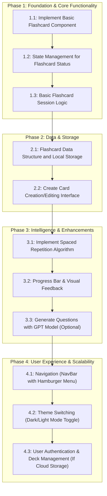

# Project Development Roadmap Flowchart

This diagram visualizes the phases and tasks for the Flashcard App development, showing the logical progression.

```mermaid
graph TD
    subgraph "Phase 1: Foundation & Core Functionality"
        A1["1.1: Implement Basic Flashcard Component"] --> A2
        A2["1.2: State Management for Flashcard Status"] --> A3
        A3["1.3: Basic Flashcard Session Logic"]
    end

    subgraph "Phase 2: Data & Storage"
        B1["2.1: Flashcard Data Structure and Local Storage"] --> B2
        B2["2.2: Create Card Creation/Editing Interface"]
    end

    subgraph "Phase 3: Intelligence & Enhancements"
        C1["3.1: Implement Spaced Repetition Algorithm"] --> C2
        C2["3.2: Progress Bar & Visual Feedback"] --> C3
        C3["3.3: Generate Questions with GPT Model (Optional)"]
    end

    subgraph "Phase 4: User Experience & Scalability"
        D1["4.1: Navigation (NavBar with Hamburger Menu)"] --> D2
        D2["4.2: Theme Switching (Dark/Light Mode Toggle)"] --> D3
        D3["4.3: User Authentication & Deck Management (If Cloud Storage)"]
    end

    A3 --> B1
    B2 --> C1
    C3 --> D1
```
