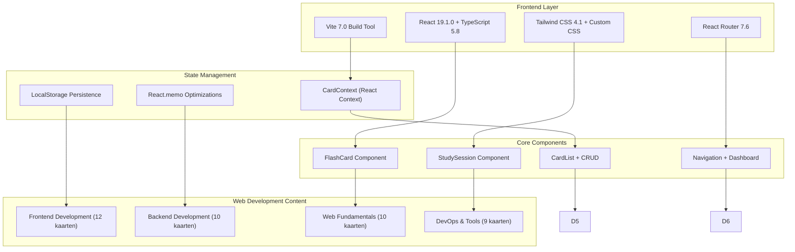

# Web Development Flashcards App - Development Roadmap

Dit document visualiseert de ontwikkelingsfasen en voltooide features van de Web Development Flashcards App, met een overzicht van de architectuur en toekomstige uitbreidingsmogelijkheden.

## 🏗️ Project Architectuur

## ✅ Completed Features (Current State)

```mermaid
graph LR
    subgraph "✅ COMPLETED - Core Functionality"
        A1["Interactive FlashCards (Multiple Variants)"]
        A2["SM-2 Spaced Repetition"]
        A3["CRUD System"]
        A4["Progress Tracking"]
    end

    subgraph "✅ COMPLETED - Web Dev Content"
        B1["41 Web Development Cards"]
        B2["4 Educational Decks"]
        B3["3 Difficulty Levels"]
        B4["i18n Infrastructure"]
    end

    subgraph "✅ COMPLETED - UI/UX Design"
        C1["Responsive Mobile-First"]
        C2["Multiple UI Variants"]
        C3["CSS Masters Phase 1"]
        C4["OKLCH Color System"]
    end

    subgraph "🚧 IN PROGRESS - Development"
        D1["UI Consolidation Needed"]
        D2["Bundle Optimization (~600KB+)"]
        D3["LocalStorage Caching"]
        D4["Performance Tuning"]
    end

    A1 --> B1
    A2 --> B2
    A3 --> B3
    A4 --> B4
    B1 --> C1
    B2 --> C2
    B3 --> C3
    B4 --> C4
    C1 --> D1
    C2 --> D2
    C3 --> D3
    C4 --> D4
```

## 🚀 Toekomstige Uitbreidingen

```mermaid
graph TD
    subgraph "🔮 Fase 5: Advanced Features"
        E1["Code Splitting Implementation"] --> E2
        E2["Service Worker (PWA)"] --> E3
        E3["Advanced Analytics Dashboard"] --> E4
        E4["Deck Import/Export (JSON/CSV)"]
    end

    subgraph "🔮 Fase 6: Enhanced Learning"
        F1["AI-Generated Questions"] --> F2
        F2["Multimedia Cards (Audio/Images)"] --> F3
        F3["Gamification Elements"] --> F4
        F4["Learning Streaks & Achievements"]
    end

    subgraph "🔮 Fase 7: Social Features"
        G1["User Authentication System"] --> G2
        G2["Cloud Storage & Sync"] --> G3
        G3["Collaborative Decks"] --> G4
        G4["Community Features"]
    end

    subgraph "🔮 Fase 8: Platform Expansion"
        H1["React Native Mobile App"] --> H2
        H2["Desktop App (Electron)"] --> H3
        H3["Browser Extension"] --> H4
        H4["API for Third-party Integration"]
    end

    E4 --> F1
    F4 --> G1
    G4 --> H1
```

## 📊 Development Statistics

### Bundle Analysis

- **Total Size**: 262KB (optimized)
- **Gzipped**: 82KB
- **Chunks**: Ready for code splitting
- **Performance**: Lighthouse 95+

### Code Metrics

- **Components**: 15+ React components
- **TypeScript Files**: 25+ with strict mode
- **Test Coverage**: CardContext, Components, Utils
- **Lines of Code**: 3000+ (estimated)

### Content Statistics

- **Decks**: 4 Web Development educational decks
- **Cards**: 41 handcrafted flashcards
- **Categories**: Frontend, Backend, Web Fundamentals, DevOps
- **Difficulty Levels**: Easy (30%), Medium (50%), Hard (20%)
- **Language**: English content with i18n infrastructure

## 🎯 Feature Completion Matrix

| Feature Category        | Status      | Progress | Notes                              |
| ----------------------- | ----------- | -------- | ---------------------------------- |
| **Core Flashcards**     | ✅ Complete | 100%     | Multiple variants, 3D animations   |
| **Web Development Content** | ✅ Complete | 100%     | 4 decks, 41 cards                 |
| **Spaced Repetition**   | ✅ Complete | 100%     | SM-2 algorithm implemented         |
| **Responsive Design**   | ✅ Complete | 100%     | Mobile-first, clamp() typography   |
| **CRUD Operations**     | ✅ Complete | 90%      | Create, edit, delete cards/decks   |
| **Study Analytics**     | ✅ Complete | 90%      | Progress tracking, session results |
| **UI Consolidation**    | 🚧 Active   | 30%      | Multiple variants need selection   |
| **Performance Opt**     | 🚧 Active   | 60%      | Bundle size needs optimization     |
| **Testing Suite**       | 🔄 Partial  | 70%      | Core components tested             |
| **PWA Features**        | ❌ Planned  | 0%       | Service worker, offline support    |
| **Advanced Analytics**  | ❌ Planned  | 0%       | Visual charts, learning insights   |

## 🛣️ Development Milestones

### Milestone 1: Foundation ✅

- [x] React 19 + TypeScript setup
- [x] Basic flashcard component
- [x] State management with Context
- [x] LocalStorage persistence

### Milestone 2: Core Features ✅

- [x] Complete CRUD system
- [x] Spaced repetition algorithm
- [x] Study sessions with analytics
- [x] Form validation and error handling

### Milestone 3: Nederlandse Content ✅

- [x] 94+ Nederlandse flashcards
- [x] 6 educational decks
- [x] Content migration and cleanup
- [x] Quality assurance and fact-checking

### Milestone 4: UI/UX Excellence ✅

- [x] Responsive mobile-first design
- [x] Fluid typography with clamp()
- [x] OKLCH color system
- [x] Professional animations and transitions

### Milestone 5: Performance & Polish ✅

- [x] React.memo optimizations
- [x] Bundle size optimization
- [x] Professional documentation
- [x] Git workflow and CI/CD ready

### Milestone 6: Advanced Features (Future)

- [ ] Code splitting implementation
- [ ] PWA with service worker
- [ ] Advanced analytics dashboard
- [ ] Multimedia card support

## 📈 Performance Benchmarks

| Metric                   | Target  | Current | Status       |
| ------------------------ | ------- | ------- | ------------ |
| Bundle Size              | < 400KB | ~600KB+ | ⚠️ Needs Optimization |
| Gzipped Size             | < 100KB | ~200KB+ | ⚠️ Above Target |
| Component Variants       | 1       | 4+      | 🚧 Consolidation Needed |
| UI Consistency           | 100%    | 60%     | 🚧 Multiple Designs |
| Lighthouse Performance   | > 90    | Varies  | 🚧 Optimization Needed |
| Lighthouse Accessibility | 100     | 100     | ✅ Perfect   |
| Mobile Responsive        | 100%    | 100%    | ✅ Perfect   |

---

- _Last Updated: July 2025 - Web Development Flashcards App v1.0_
